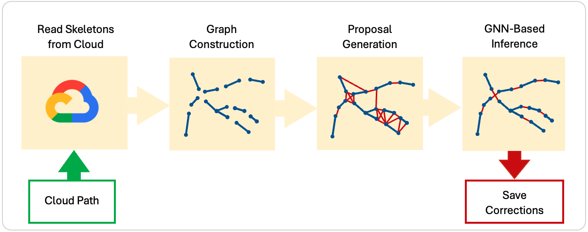

# GraphTrace

[](LICENSE)

[](https://github.com/semantic-release/semantic-release)


## Overview

GraphTrace is a Python library that leverages machine learning to automatically correct splits in fragmented neuron segmentations from whole-brain images.

<p>
  
  <br>
   <b> Figure: </b>Neuron fragments corrected by using GraphTrace.
</p>

Briefly describe inference pipeline, to do...

- Graph Construction: Reads neuron fragments stored as swc files and loads them into a Networkx graph.
- Proposals: Generates potential connections between nearby fragments to correct false splits in the segmentation
- Feature Generation: Extracts geometric and image-based features from the graph to be utilized by a machine learning model that classifies the proposals.
- Graph Neural Network (GNN) Inference: Predicts whether to accept or reject proposals based on the generated features and graphical structure.
- Graph Update: Integrates inference results by merging fragments corresponding to an accepted proposal.

<p align="center">
  
    <br>
  <b> Figure: </b>Visualization of split correction pipeline, see Inference section for description of each step.
</p>

## Inference

### Step 1: Graph Construction

To do...

### Step 2: Proposal Generation

To do...

### Step 3: Proposal Classification

To do...

## Installation
To use the software, in the root directory, run
```bash
pip install -e .
```

## License
GraphTrace is licensed under the MIT License.
