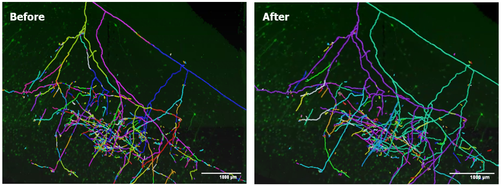

# GraphTrace

[](LICENSE)

[](https://github.com/semantic-release/semantic-release)


GraphTrace is a Python library that utilizes machine learning to perform automated reconstruction of a fragmented neuron segmentation from whole brain images.

<p>
  
</p>

## Key Features

- Graph Construction: Reads neuron fragments stored as swc files and loads them into a Networkx graph
- Proposals: Generates potential connections between nearby fragments to correct false splits in the segmentation
- Feature Generation: Extracts geometric and image-based features from the graph to be utilized by a machine learning model for classifying proposals.
- Graph Neural Network (GNN) Inference: Predicts whether to accept or reject proposals based on the generated features and graphical structure.
- Graph Update: Integrates inference results by merging fragments corresponding to an accepted proposal, resulting in a more accurate representation of neuron structures.

## Installation
To use the software, in the root directory, run
```bash
pip install -e .
```

To develop the code, run
```bash
git clone 
pip install -e .[dev]
```

## Contributing
We welcome contributions from the community! If you have suggestions, improvements, or bug reports, please open an issue or submit a pull request.

## License
GraphTrace is licensed under the MIT License.
